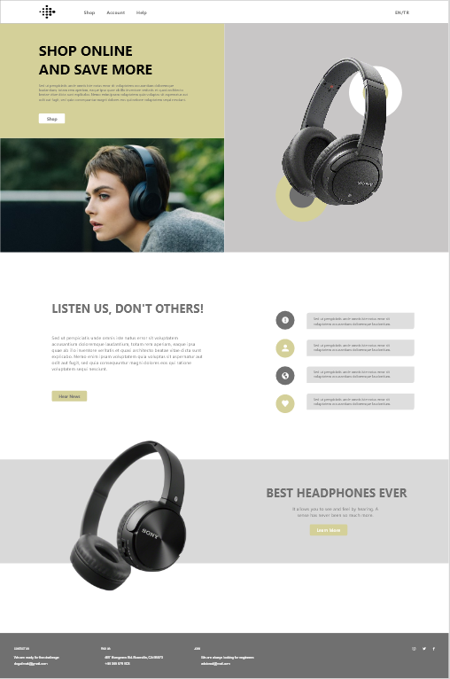
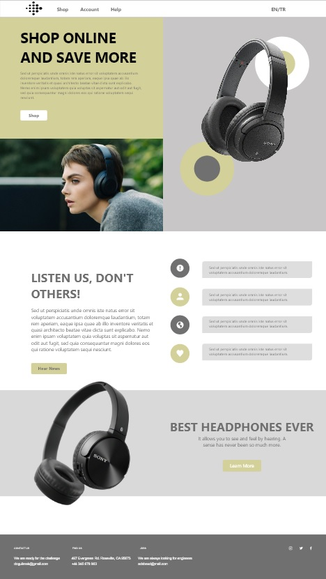

# Webpage for Sony Headphones

## Statement

In this project, a responsive web page was created for 4 different devices. The web page has been developed to be compatible with **1920, 1366, 10 inc Samsung Galaxy Tab and iPhone X, XS and 11 Pro models**. The buttons are not given any qualifications. It has been created to be used as desired.

## Previews

## 1920 Resolution Preview

You can see the preview of the 1920x2900 pixel web page below.

     

## 1366 Resolution Preview

You can see the preview of the 1366x2426 pixel web page below.

     

## 10 inc Samsung Galaxy Tab 

You can see the preview of the 800x2912 pixel web page below.

     

## iPhone X, XS, 11 Pro

You can see the preview of the 375x1065 pixel web page below.

     

PNG Source: 
https://www.pngwing.com/en/free-png-yhyuo/download

## Contact Me

If you have something to say to me please contact me: 

 - Twitter: [Doguilmak](https://twitter.com/Doguilmak)  
 - Mail address: doguilmak@gmail.com
